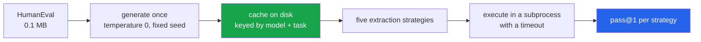

<h1 align="center">code-eval-harness (Python · pandas · PyArrow · Hugging Face Hub)</h1>
<p align="center"><i>The same answers, five different scores</i></p>

<p align="center">
  <a href="docs/RESULTS.md">Results</a> &middot;
  <a href="docs/METHOD.md">Method</a> &middot;
  <a href="docs/PROBLEMS.md">Problems hit</a> &middot;
  <a href="docs/LIMITATIONS.md">Limitations</a> &middot;
  <a href="docs/FUTURE.md">Future work</a> &middot;
  <a href="#run-it">Run it</a>
</p>

<p align="center">
  <a href="https://github.com/hammasbuilds/code-eval-harness/actions/workflows/ci.yml"></a>
  <a href="LICENSE"></a>
  
  
  
  
  <a href="https://github.com/astral-sh/ruff"></a>
</p>

---

> ### Identical generations score 0% or 94% on HumanEval, depending only on how the code is pulled out of the model's output.

A code benchmark is reported as **one number**. But between the model's output and that
number sits an **extraction step** - recovering code from whatever prose and markdown the
model wrapped it in - and that step is a free parameter almost nobody reports.

Here each solution is generated **once**, cached, then scored under five extraction
strategies. Any spread is the harness's fault, because the model output never changed.

---

## The result

All 164 HumanEval problems, greedy decoding, one generation per (model, problem):

| Model | `raw` | `prompt+body` | `first_fence` | `all_fences` | `smart` |
|---|---:|---:|---:|---:|---:|
| qwen2.5-coder:14b | **0.0%** | **0.0%** | 85.4% | 85.4% | 85.4% |
| qwen2.5:14b-instruct | **0.0%** | **0.0%** | 77.3% | 77.3% | 77.3% |

**85 points of spread, from extraction alone.** The generations never changed.

### It is one finding with two faces, not five results

Being precise, because the table overstates the number of independent findings: **both 0%
strategies fail for the identical reason.** Every failure is a `SyntaxError`, and the cause
is the same - the models wrap answers in fences, and backticks are not Python.

The substantive half is that **`prompt+body` is the original HumanEval protocol**, designed
for *completion* models. A chat-tuned model restates the whole function inside a fence, so
the concatenation is a syntax error. **A harness built for completion models silently
reports chat models as incapable.**

### The three fence rules never disagree, and that was worth testing

`first_fence`, `all_fences` and `smart` score identically on **every one of 327 records,
across both models**. `smart` is the elaborate one - it strips prose, picks the block that
defines a function, handles an unterminated fence - and it buys nothing over taking the
first fenced block.

This was run specifically to make them disagree, and the prediction failed. The earlier
version of this page used three models including a 3B, and the rules agreed everywhere; the
obvious explanation was that a code-tuned model emits unusually clean fences. So the models
were changed to a matched pair - `qwen2.5-coder:14b` and `qwen2.5:14b-instruct`, same size,
same family, one of them tuned to explain itself rather than to emit code.

The instruct model still fences cleanly. **It scores 8 points lower overall, and its
extraction behaviour is identical.** So the sophisticated rule is not earning its place on
any model tested here, and the honest summary of the five strategies is two groups: *parse
the fence*, or *do not*. Everything inside the first group is the same rule.

&#128202; **[Full results, per-strategy failure reasons, and the model comparison &rarr;](docs/RESULTS.md)**

---

## The coder model is 8 points ahead of its instruct sibling

Under any fence rule, on all 164 problems:

```
qwen2.5-coder:14b     85.4%
qwen2.5:14b-instruct  77.3%
```

Same size, same family, same quantisation, same prompt - only the tuning differs. **8.1
points for code tuning at 14B**, which is consistent with the +10.0 that
[code-llm-lab](https://github.com/hammasbuilds/code-llm-lab) measures on MBPP for the same
pair.

The earlier version of this page compared a 3B, a 7B and a 14B and found them
indistinguishable at 94.0% on the first 50 problems. That comparison is withdrawn: 50
problems was too few, and the models were not a matched pair.

---

## How it works



**Generation and scoring are separate on purpose.** Adding a sixth strategy and re-scoring
costs **no model time at all**.

&#128269; **[The five strategies and what each one assumes &rarr;](docs/METHOD.md)**

---

## Run it

```bash
python src/run_eval.py 50     # generate (cached) and score
pytest -q                     # 19 tests, no network, no model calls
```

---

## Input


## Output


*Nothing about the model changed between the first row and the third. The generations are
cached on disk and every strategy reads the same files. A HumanEval number published without
its extraction strategy is not a measurement of the model.*

*The third column is the stronger half. `qwen2.5-coder:14b` has **4.8x the parameters** of
the 3B and scores **identically** under all five strategies — while failing a different set
of problems. Extraction moves the score 94 points; model size moves it zero.*

### &#9888; Safety

`run_tests` executes code written by a language model. It runs in a separate process, in a
throwaway temp directory, with a timeout - **but it is not a security sandbox.** Do not
point it at untrusted generations on a machine you care about.

---

## The harness shipped with this exact bug

The runner interpolated `repr(entry_point)`, so HumanEval's `check()` received the **string**
`"add"` instead of the function. Every test failed with `'str' object is not callable` -
**the harness reported 0% for models that were answering correctly.**

That is precisely the failure this repo exists to measure, and it happened here first.

&#128736; **[Every problem hit while building this &rarr;](docs/PROBLEMS.md)**

---

## Also worth reading

| | |
|---|---|
| &#128202; **[Results](docs/RESULTS.md)** | Full tables, failure reasons, model comparison |
| &#128269; **[Method](docs/METHOD.md)** | The five strategies, caching, execution |
| &#128736; **[Problems hit](docs/PROBLEMS.md)** | The entry-point bug, plotly, buffered logs |
| &#9888; **[Limitations](docs/LIMITATIONS.md)** | Why 94% is not comparable to published pass@1 |
| &#128640; **[Future work](docs/FUTURE.md)** | Full 164, pass@k, MBPP, a real sandbox |

---

## Layout

```
src/core.py       data loading, generation + cache, five strategies, execution
src/run_eval.py   generate once, score every way, write results/scores.json
tests/            19 tests using hand-written "model output" - no ollama needed
docs/             detailed documentation
```

## Stack

`Python 3.11+` &middot; `Ollama` (local inference) &middot; `pandas` &middot; `pyarrow`
&middot; `pytest` &middot; `ruff` &middot;
`GitHub Actions` &middot; HumanEval via `Hugging Face Hub`

## Keywords

HumanEval &middot; pass@k &middot; pass@1 &middot; code generation benchmark &middot;
LLM evaluation &middot; evaluation harness &middot; answer extraction &middot;
benchmark reproducibility &middot; local LLM &middot; Ollama &middot; Qwen2.5 &middot;
code LLM &middot; prompt sensitivity &middot; harness bias &middot;
LLM benchmarking methodology &middot; deterministic evaluation

## Licence

MIT - see [LICENSE](LICENSE).
